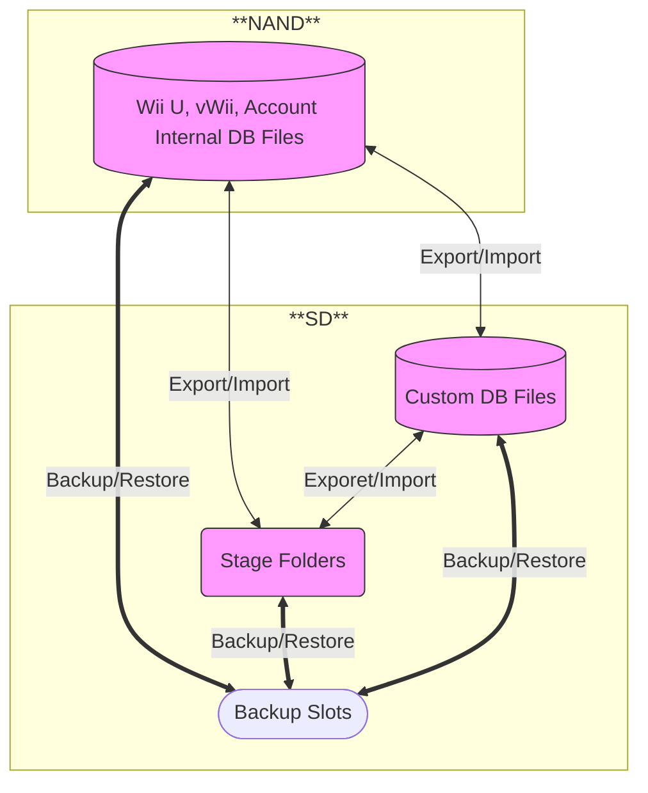

<a href="https://github.com/w3irdv/savemii/" title="SaveMii">Back&nbsp&nbsp&nbsp</a>

## Mii Management

This menu allows you to:
- Backup / Restore internal Wii U, Account and Wii mii databases (repos)
- Wipe / Initialize internal Wii U and Wii mii databases
- Export / Import / Wipe individual miis between internal Wii U/Account/Wii repos and stage repos on the SD (including SavegameManager GX repos)
- Transform individual miis on any repo. You can:
    - Make a mii local to the console, transfer ownership from one mii to another, transfer physical attributes from one mii to another, convert betwen Normal/Special/Temporal miis, togle copy and share attributes, update mii Id, make a mii a favorite one, update its CRC checksum

### Relation between repos and tasks.
Savemii has configured the following type of repos:
- Internal Wii U (FFL), Account and Wii (RFL) databases
- Stage folders: folder on the SD where you can put individual mii files (FFL_Stage, Account_Stage and RFL_Stage).
- Custom DB Files: FFL/RFL or Account databases on the SD , for testing puposes. They live on the SD. When ready (after importing and transforming miis as you wish), can be copied to CEMU or Dolphin installations.

**Note**: You can create an account custom db, by making an Account Mii Database backup and manually copying `8000000x/` folders from `SD:/wiiu/backups/MiiRepoBckp/mii_bckp_account/(slot_number)/`  to `SD:/wiiu/backups/MiiRepoBckp/mii_bckp_account_c`.

You can backup/restore any repo to/from a slot (whole databases). Each repo has its own set of slots, named from 0 to 255 (you can optionally tag them)

You can export/import miis between any repos

### Tasks operating on full repos

1. First, select the repo you want to manage
2. Select the task you want to perform on it.

#### Backup / Restore  Tasks
1. Select the slot you want to use
2. Press `A` to initiate the backup or the restore. After the backup is done, you can tag the slot with a meaningful name pressing `+` button while you are in the backup menu. If the slot is unneeded, you can delete it by pressing `-` button.

Backup will include:
* Internal Wii U: FFL_ODB.dat and stadio.sav files. Can be moved between consoles.
* Internal Wii: RFL_DB.dat file. Can be moved between consoles
* Wii U Account database: all files under the act  profile folder for each profile in the console ( `account.dat`, `miiimgXX.dat`). `account.dat` has an attribute with the mii image data (MiiData) but also contain the pasword of the profile and a lot of other stuff. For this reason, **Savemii only allows you to restore account data if it belongs to the same console** (i.e, if the serial id of the backup is the same than the serial id of the console when you are trying to restore). This check can be spoofed, **so be sure of what you are doing** in the case that you are restoring between different consoles, or if you try to restore a backup of a reinstalled console (which will probably share the serial id). In the later case, **the safe approach is just to Import indivdually each account mii or use the Restore DB Mii Section task**. `miimgXX.dat` are static pictures of the mii that the Wii U apps can use. Is updated when you register a mii against a profile. 
* Stage folders: copy of the individual mii files
* Custom DB folders: same files that in the case of internal ones.

#### Wipe DB task
1. Press `A` to initiate the wipe of the database. This will delete any file on a stage folder, or the FFL/RFL dat file in the case of internal databases. Account databases cannot be wiped.

#### Initialize DB task
1. Press `A` to initialize a database. *Beware: This will delete of miis in the selected database*. In the case of a stage folder, it is equivalent to a wipe. For internal Wii U or Wii databases, it will create an empty  FFL/RFL dat file ready to accept miis from the import/export tasks. For the internal Wii U database it will also create a stadio.sav file containing information from the account miis. Account databases cannot be initialized. 

You must initialize custom databases if you want to play with them.

### Tasks operating on individual miis

#### List miis
All miis in te selected repo will be shown. With `X` you can cycle between different screens showing different miis attributes:
- copyable, shareable, normal/special/temp, favourite, duplicated. Duplicate Miis are marked with a D or DUP. Mii Maker will delete any all but one duplicate miis, Mii Channel don't seem to pay attention to this fact.
- partial device_hash and author_id where the mii was created
- mii_id (some flags + timestamp) , partial device_hash
- location (slot number for FFL or RFL databases, filename for Stage or Account databases)
- creator name and birth platform
- timestamp

#### Export Miis
Export individual miis from one repo to a different one. Select/Deselect the individual miis to export  with `Y`, `DPAD-L/R`, or `+/-` for select/deselect all. Then Press `A`. For internal Databases, the miis will be copied to the corresponding Stage Repo. For other databases, a new menu will appear where you can select the repo to export to. Press `A` again after moving the cursor to the desired repo.

#### Import Miis
You can Import individual miis from a repo to the selected repo. For internal Databases, the miis will be copied from the corresponding Stage Repo. For other databases, a new menu will appear where you can select the repo to import from. Press `A` again after moving the cursor to the desired repo. Then select the miis wou want to import with `Y`, `DPAD-L/R`, or `+/-`m an press `A` to proceed with the import

**Note**: When you improt a mii in a Account repo tou mist select wich account mii to overwrite. All Usual Mii data (appearance, name, flags, ... ) will be copied from the mii to the account mii.

#### Wipe Miis
Select/Deselect the individual miis to wipe with `Y`, `DPAD-L/R`, or `+/-` for select/deselect all. Then Press `A`

#### Transform Miis
Here you can apply a series of transfromation over a mii. First select the miis you want to modify with `Y`, `DPAD-L/R`, or `+/-`, as usual. Press `A`. The Transform Tasks menu will appear. You can move up/down the different tasks, and select / deselect wich ones you want to apply over the selected miis with `Y`, `DPAD-L/R`. Press `A` when you have selected all the tasks that you need to apply. Trasfer Appearance and Trasnsfer ownership tasks will neeed a Mii to be used as a template. First select the Repo where the template mii is located, then select the template Mii. Press `A` to transform the selected miis.

Available tasks:
- Transfer physical appearance from another mii: Selected miis will get the physical appearance of the mii you will select in the next menu
- Transfer Ownership from another mii: Selected miis will get the ownership attributes of the template mii, so after they will belong to template console. Current games association is lost
- Make them belong to this console: Updates MAC Address and AuthID (WiiU) of the Mii, so that it will apeear as created on this console. Updates Mii Id, so games association is lost
- Update Mii Id (Timestamp): So the mii has a new unique Mii Id (Beware! It will no longer be tied to any game that expects the older Mii Id)
- Toggle favorite flag: Mark Miis as a favorite one so they appear in games that support them
- Toggle Share/Mingle flag: So the mii can travel to other consoles
- Toggle Normal/Special flag: You can transform a normal Mii into an special one, and viceversa. This updates the Mii Id, so games association is lost
- Toggle Foreign flag: Wii Miis can be forced as foreign irrespective of where they were created. This updates the Mii Id (mii games association is lost)
- Update CRC: CRC will be recalculated for the selected mii (if in ffsd,bin,cfsd or rsd files) or for the entire DB (for miis in a FFL or RFL file repo)
- Togle Copy Flag On/Off: So people that does not own the mii can modifiy it by creating a copy of the original
- Togle Temporary Flag On/Off: Temporary Miis cannot be seen in FFL DB. This updates the Mii Id (mii games association is lost)

**Note**: Not all tasks can be selected on all repos. It the tasks is not available for the type of repo that you are managing, you won't be able to select it.

### Account miis are special ...
After restoring/importing or transforming an account mii, you will need to restart the console for the changes to have effect.

If you have restored the DB Mii Section, imported or transformed an account mii, you will also need to re-register the mii in order to the `miiimgXX.dat` files to be regenerated. If not, a mixture of the old mii and of the new mii will be shown.

