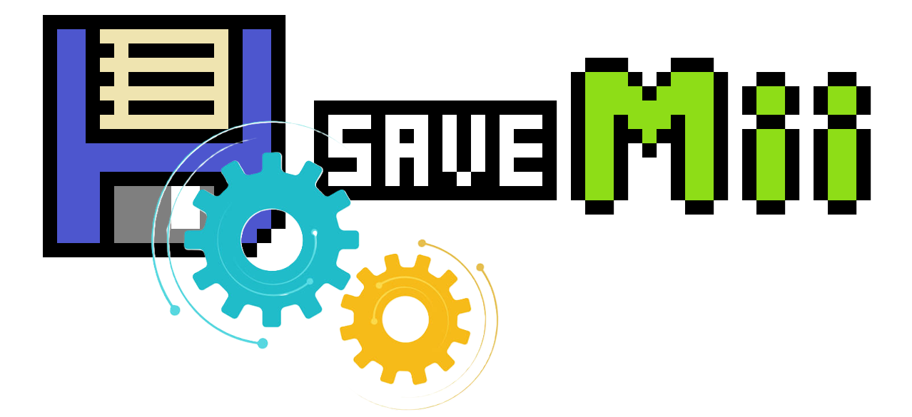

<p align="right">
<a href="https://github.com/w3irdv/savemii/#savemii-wut-port-processmod--savemymiis" title="SaveMii">Back</a>&nbsp&nbsp
<a href="https://github.com/w3irdv/savemii/#savemii-wut-port-processmod--savemymiis" title="SaveMii"></a>
<p align="right">

# SaveMii Savedata Management

## Wii U Title Management / vWii Title Management /  Wii U System Titles Management

Allows you to backup/restore/wipe individual titles.

1. First select the title you want to manage.
	1. Wii U titles: If the title has not been initialized (you have not created an initial save by playing to it beforehand) it will be marked as "Not init" and will appear in yellow. Starting from SaveMii v1.8.0 you can try to manage it (restore savedata from a previous backup) and it should work. If not, just first play and create "real" savedata before trying to restore any backup.
		1. An special case of this are vWii injects. They will appear in "Wii U Title Management" marked as "vWii injects". They have savedata in the vWii side, but for "real" vWii injects (GameCube injects are excluded), from saveMii 1.8.0 you can manage the its Savedata directly from the WiiU Title entry.    
2. Select the task you want to do:
	1. Backup: Copy savedata from USB/NAND to SD
	2. Restore: Copy savedata from SD to USB/NAND
	3. Wipe: Delete savedata from USB/NAND
	4. Move to Other Profile: Move savedata from one profile to a different one, Target profile will be wiped
	5. Copy to Other Profile: Copy savedata from one profile to a different profile. You will end with two copies of your savedata in different profiles.
	6. Export / Import to Loadiine: Legacy options to manage Loadiine savedata
	7. Copy to other Device: If savedata for a title is present in USB and NAND, copy it from one storage to the other

   You can now manage Wii U Sistem titles (MiiMaker, Browser, ... ). But take extra careful when you backup/wipe/restore them, because if you left them unconsistent you can in some extreme cases (semi) brick your Wii U. Nothing that probably cannot be fixed with UDPIH and the Recovery Menu (see [Tips](Tips_README.md#recover-your-wii-u-in-case-of-a-brick-after-a-faulty-system-title-restore)).

**Always** perform an `All Users` backup before trying any restore/copy/move/wipe operation !!!

### Backup
1. Select a slot to store the savedata. You can select any number from 0 to 255, each one representing a different folder in the SD card. Individual backups will always be stored in the `Root backupSet`. Next to the slot number you will see a `[T]`if the title backup is using titleName format, or an `[H]` if it is using hexadecimal format. 
2. For Wii U titles, select which data to save:
	1. `Only common save`. This option will copy only common savedata.
	2. `All users`: Recommended option. Will backup all game data.
	3. `From user: xxxxxxxx`. Will only backup the data for the specified user/profile. In this case, you must also specify if you want to save the "common" data or not. "Common" savedata is data shared by all profiles. Titles can have common save data, profile savedata or both.

	 For vWii titles, you can choose the savedata format: "plain files", where  all individual files are copied to the selected slot in the SD card, or "compressed", where all files will be archived in a `data.bin` file. For the compressed format to work you need to provide some Wii encryption keys. See the [Encyption keys](#encryption-keys) section.
3. Press `A` to initiate the backup. After the backup is done, you can tag the slot with a meaningful name pressing `+` button while you are in the backup menu. If the slot is unneeded, you can delete it by pressing `-` button.

*Wii U titles savedata layout:*

```
sd:/wiiu/backups/         # Root backupSet
    TitleName [xxxxxxxx-yyyyyyy]/     #  New format! Legacy format was: xxxxxxxxyyyyyyy 
        0/
            SaveMiiMeta.json
            80000001/     # one folder for each profile
                ...       # savedata
            80000002/
                ...
            ...
            common/
                ...
        1/                 # one folder for each slot
            ...
```

For vWii titles, savedata is directly under the slot folder.

**Note**: Starting with version 1.7.0, backup folders for new titles will _always_ be named after the title name. For older titles that use hexadecimal format, SaveMii will prompt you to convert them to the new format when it detects one. You can disable this prompt in the Options menu screen. If for the same title there is a backup folder using hexadecimal format and a also a backup folder using titleName format, data will always be stored inside the hexadecimal folder. If you decide to convert the hexadecimal folder to titleName format, its content will be merged with the one in the titleName folder (in a new slot), and from then on only the titleName folder will be used.
### Restore
1. Select a slot to get the data from.  If you haven't selected any backupSet, the data from the `Root backupSet`  (the one where the manual backups are always stored) is used. But you can also use data from any batch backupSet, by pressing the `X` button and selecting the backupSet you want to use. Notice that the last backupSet you previously selected in any task (Batch Restore or BackupSet Management) will be the one used here by default. BackupSets can be tagged by pressing `+` button in the BackupSet List Menu, or from the BackupSet Management in Main menu.
   To identify which data the slot contains: If the slot has been tagged, you will see its tag next to the slot number. On the top screen line, you will see which backupSet is being used. And at the last screen line, you can see when the savedata were taken, and from which console. Finally, next to the slot number you will see a `[T]`if the title backup is using titleName format, or an `[H]` if it is using hexadecimal format. In case that hexadecimal and titleName folder exists for the same title, save data from the hexadecimal folder will always be used. Conversion will merge slots from both savedata, and then only the new titleName folder will be used.
2. For Wii U titles, select witch data to restore:
	1. `Only common save`
       This will restore only common savedata.
	2. `From: All users / To: Same user than Source`
	    This will restore all save data (profiles+common) from the selected slot keeping the same userid that was used to backup the data. This option can only be used to restore previous savedata from the same console, or if the profile ids in the new console are identical to the ones in the source console. If profile ids from source and target differ, you must use the next option.
   3. `From: select source user / To: select target user`. This will copy savedata from the specified source profile id in the slot backup to the specified target profile id in the console. You can specify if copy common savedata or not.
	   If you are just copying the savedata from one profile id to a different one in the same console, choose `copy common savedata: no`. If you  are restoring to a new console with different profile ids, just choose `copy common savedata: yes` once for any of the profile ids, and copy the rest of profiles with `copy common savedata: no`
<<<<<<< Updated upstream

	 For vWii titles, the restore task will check if the slot contains a `data.bin` file. If so, the restore tasks will by default decrypt and explode the files contained in the `data.bin` (you will need to provide the Wii shared decryption keys -from any Wii will do- for this to work, see the [Encyption keys](#encryption-keys) section.). Usually, this 'data.bin' will be a "true" savedata if you have:
=======
<<<<<<< Updated upstream
	 4. Press `A` to initiate the restore. 
=======

	 For vWii titles, the restore task will check if the slot contains a `data.bin` file. If so, the restore tasks will by default decrypt and explode the files contained in the `data.bin` (you will need to provide the Wii shared decryption keys -from any Wii will do- for this to work, see the [Encyption keys](#encryption-keys) section). Usually, this 'data.bin' will be a "true" savedata if you have:
>>>>>>> Stashed changes
	- backup previously the data in compressed format
	- downloaded the a `.bin` savedata file from internet. Change its name to `data.bin` so SaveMii can detect it.
	- copied it from the SD folder `/private/wii/title/<Product Code>` (where savedata exported by the Wii Data Management menu is stored) to the SaveMii slot. 

	 If you haven't done nothing of the above, then this `data.bin` file should be not a standard compressed savedata file but just part of the savedata files for the game, so just select "compress = no" and the file will be copied "as is" to the vWiii internal storage.    

3. Press `A` to initiate the restore. 
<<<<<<< Updated upstream
=======
>>>>>>> Stashed changes
>>>>>>> Stashed changes
	    **Note**: Starting with version 1.7.0, the `From: All Users` restore will detect and not allow restoring savedata to non-existent user profiles. In this case, perform specific `From: Select Source User / To: Select Destination User` restores, selecting the correct users.

**Note**: If you have manually copied  to a nomal backup slot a Loadiine savedata in shared mode format (`/u` and `/c` folders), SaveMii will detect it and will rename the folders to the current user (`/8000000x` and `/common`), so you can afterwards restore it from this menu task.

### Wipe
Sometimes you will need to wipe savedata in the console before restoring a previous backup: If a restore is unsuccesful, you can try to wipe previous data before attempting a new restore. Options are the same than in the *Backup* task, but now refer to savedata for the specified title in the NAND or in the USB. 

### Move to other profile

You can directly move copy the savedata from one profile to a different profile in the same title+storage type. Target profile will be wiped, and then source profile will be renamed to the new profile. Common savedata is left untouched.  
Select witch data to move:

1. `From: select source user / To: select target user`. This will copy savedata from the specified source profile id in the slot backup to the specified target profile id in the console.
2. Press `A` to initiate the move. 

### Copy to other profile

You can directly copy the savedata from one profile to a different profile in the same title+storage type. You will end with two copies of the savedata in two different profiles.  Common savedata is left untouched.
Select witch data to copy:

1. `From: select source user / To: select target user`. This will copy savedata from the specified source profile id in the slot backup to the specified target profile id in the console.
2. Press `A` to initiate the copy. 

### Copy to other device
If a title has savedata in  NAND and in USB, you can transfer it between both storages. Options are the same than in the *Restore* task.

### Import from Loadiine
You can enter into this task only if the game has savedata in the Loadiine folder `SD:/wiiu/saves`. It allows you to import this savedata in to the console game savedata folders in NAND or USB. `SaveMii` will search for folders containing the the four letters game's product code, its lowercase hexadecimal ID (`xxxxxxxxyyyyyyyy`) or the title name in the format already used by `SaveMii`.

All these variants will be found:

```
SD:/wiiu/saves/AXFE/
SD:/wiiu/saves/AXFE01/
SD:/wiiu/saves/0005000010144f00/
SD:/wiiu/saves/Smash Bross [AXFE]/
...
```

1. Select the `version` number to get data from. 
2. Select the WiiU User to copy from. Depending on the user you choose, one of the Loadiine Savedata Modes will be used. If you select users `u` or `shared`, shared savedata mode will be used. In this mode profile savedata is located in the `u` folder, and common savedata is located in the `c`folder. If you select a nomal profile (any `8000000x`) or the user `unique`, unique mode will be used. In this case profile savedata is locaed in the Wii U default folders  (`8000000x` and `common`).
3. Select the WiiU user to copy to. This can only be one of the real profiles (`8000000x`).
4. If there is `common` savedata in the loadiine folder, select whether to copy it (in most cases, you will). The selected source user will determine where to look for shared saved data. For `u` or `shared` users, the `c` folder will be used. For `unique` or normal profiles, the usual `common` folder will be used.
5. Press `A` to initiate the import. 

### Export to Loadiine
You can enter into this task only if the game has savedata in the Loadiine folder `SD:/wiiu/saves`. It allows you to export game savedata in NAND or USB to the SD loadiine save folder. `SaveMii` will search for folders containing the four letters game's product code (`AXFP`, for example), its lowercase hexadecimal ID (`xxxxxxxxyyyyyyyy`) or the title name in the format already used by `SaveMii`.

1. Select the `version` number where you want to save the game savedata. 
2. Select the Wii U User to copy savedata from. User `u` will appear always as Empty. Select  the real non-empty profile with savetada  (`8000000x`) that you want to export (soem games have only savedata in the `common` folder, an all profiles will appear as empty).
3. Select the Wii U User to copy to. Depending on the user you choose, one of the Loadine Savedata Modes will be used. If you select  users `u` or `shared`, shared savedata mode will be used. In this mode profile savedata is located in the `u` folder, and common savedata is located in the `c`folder. If you select a nomal profile (any `8000000x`) or the user `unique`, unique mode will be used. In this case profile savedata is locaed in the wii u default folders  (`8000000x` for profiles, and `common` for common).
4. If there is `common` savedata in the loadiine folder, select whether to copy it (in most cases, you will). The selected source user will determine where to look for shared saved data. For `u` or `shared` users, the `c` folder will be used. For `unique` or normal profiles, the usual `common` folder will be used.
5. Press `A` to initiate the export.


### Import/Export to private SD Wii Data Management slots (Wii titles only)
 These tasks will copy Wii title savedata in `data.bin` format between the SD folder `SD:/private/wii/title/<ProductCode>` and the vWii NAND, just like the standard Wii Data Management does. The only difference is that you can import/export savedata even if it is copy-protected (alternatively, you can install Priiloader in the vWii and disable copy protection for savedata). 

1. Enter into the task and just press `A` to initiate the import or the export task. For import tasks, SaveMii will check if the savedata in the SD belongs to the title and region you are trying to import to.

If neded, you can select which keys to use to encrypt by pressing `X` in the Export task menu. This will open the KeyList menu. All files in the `SD:/wiiu/backups/keys` folder will be shown. Select with `A`, `X`, and `Y` which file has to be used to get the private, shared keys or the mac address. For more details, please see the [Encyption keys](#encryption-keys) section.


## Encryption Keys

 To Backup or Restore a `data.bin` savedata file you will need the Wii encryption keys.

These are the keys needed for restoring a `data.bin` file  (they are the same for all Wiis):
- sd_key
- sd_iv
- md5_blanker

If you have access to a homebrewed Wii you can generate them with [xyzzy](https://oscwii.org/library/app/xyzzy-mod) hb app. Simply ensure that the `keys.txt` file that `xyyzz` generates is placed on the root of the SD you use for loading Aroma. If you cannot run `xyzzy`, you can google the value for them (beware: *wii decryption keys*, not the Wii U ones!) and create a `keys.txt` file in the root of your sd with this content:
```
sd_key      = xxxxxxxxxxxxxxxxxxxxxxxxxxxxxxxx                     (32 hex digits)
sd_iv       = xxxxxxxxxxxxxxxxxxxxxxxxxxxxxxxx                     (32 hex digits)
md5_blanker = xxxxxxxxxxxxxxxxxxxxxxxxxxxxxxxx                     (32 hex digits)
```
where xxxx...xxxx are a sequence of 32 hexadecimal digits   (no `0x`  in front of them, just the digits).

To create a `data.bin` file, in addition to the above shared keys, you will need these keys:

- console_id
- ecc_private_key
- ng_key_id
- ng_signature

and a mac address (SaveMii will use the one ftom the Wii U by default).

These keys are already found in the `otp.bin` file that Aroma generates by default, so you don't need to worry about them. They can be found also in the `keys.txt` file generated by `zyxxy` in a real Wii (important: if you run `zyxxy`in a vWii, the `keys.txt` file will miss ng_key_id and ng_signature). 

Despite being different from Wii to Wii, you can use the private keys belonging to any Wii to generate a savedata file in `data.bin` format that can be read in any other Wii. 

### Where SaveMii looks for keys

By default, SaveMii will:
- look for a `keys.txt` file in the root of your SD card to load the shared keys. This is the only file needed to restore a `data.bin` file. These keys are the same for all Wii consoles, and are **the only one that you need to provide by yourself**.
- look for `sd:/wiiu/backups/<console serial id >/otp.bin` to load the private keys (Aroma generates this  file). Both these and the the shared keys are needed to backup savedata files in `data.bin` format
- get the MAC Address from the Wii U, also needed for create backups in `data.bin` format. 

You can also copy `keys.txt`, `otp.bin` or just txt files containing  the shared keys, the private keys or the MAC Address to the `sd:/wiiu/backups/keys` folder.
```
console_id      = xxxxxxxx        (8 hex digits)
ecc_private_key = xxxxxxxxxxxxxxxxxxxxxxxxxxxxxxxxxxxxxxxxxxxxxxxxxxxxxxxxxxx     (60 hex digits)
ng_key_id       = xxxxxxxx        (8 hex digits)
ng_signature    = xxxxxxxxxxxxxxxxxxxxxxxxxxxxxxxxx..................xxxxxxxxxxxxxxxxxxxxxxxxxx     (120 hex digits)
mac_address     = xxxxxxxxxxxx     (12 hex digits)
```
Then, from the `Backup` or `Export` tasks, you can press `X` to open the KeyList menu. All files in the `keys` folder will be shown. Select with `A`, `X`, and `Y` which file has to be used to get the private keys, the shared keys or the Mac Address.  

## Configuration Options

Press `X` in the Main Menu to enter the Options screen. You can:

- Select Language
- Decide if Backup Excludes are always applied when entering the Title Select screen in Batch Backup
- Enable/disable the prompt for folder format conversion between the legacy hex format (`xxxxxxxxyyyyyyy`) and the title name format (`Title Name [xxxxxxxx-yyyyyyy]`)
- Enable/disable the prompt to delete savedata from non-existent profiles and to allow/not allow restores to non-existent profiles.

Configuration can be saved by pressing `+`


