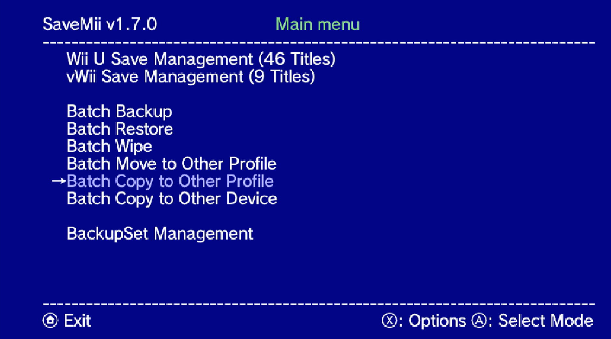
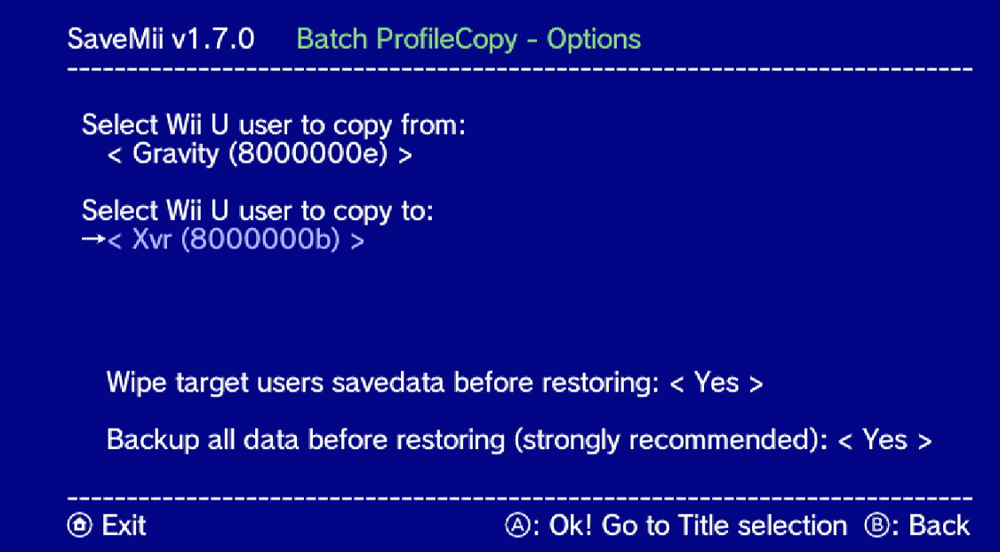
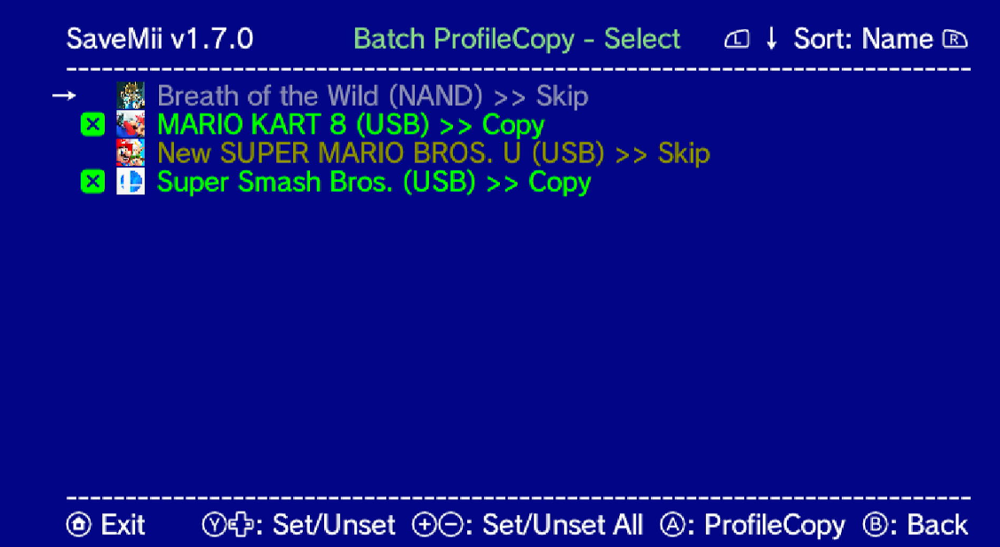
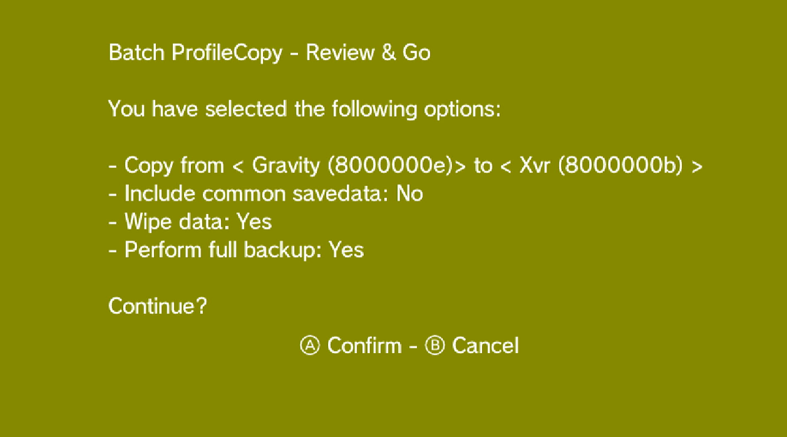
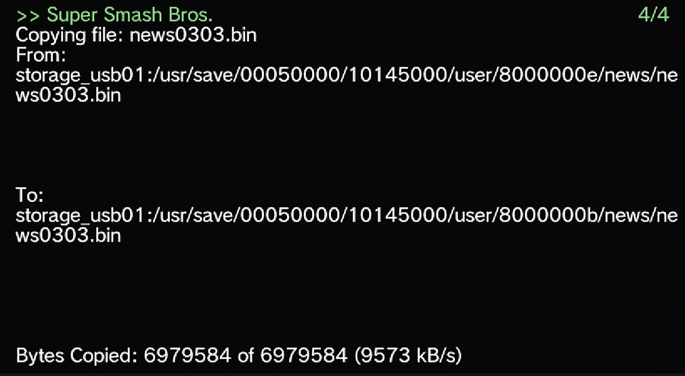
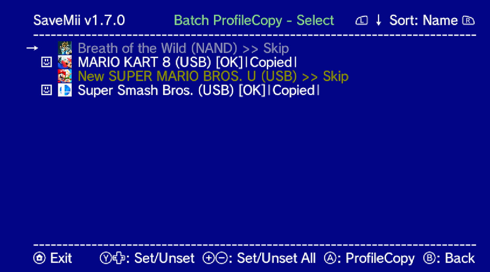

#  How To - The easiest way to transfer save data to your Pretendo Network account (Wii U)

## Objective

Simplify the savedata transfer from an old NNID to a new PNID using a new feature of SaveMii 1.7.0 : `Batch Copy/Move Pofile`.

The difference between Move and Copy is as follows:
* Move will delete the data from the destination user and then move the saved data from the source user to the destination user. In the end, you will only have one copy of the saved data in the new PNID profile.
* Copy will (optionally) delete the destination data and then copy the source data to the destination profile, so you will have two copies of the saved data (the source data is not modified at all).

It is recommended to use `Batch Copy to Other Profile`.

## Prerequisites
I will assume that you have followed the [Pretendo Setup Guide](https://pretendo.network/docs/install/wiiu) till the section  `Transferring save data to your Pretendo Network account`, so that you have already created a new PNID. And that you have already installed [SaveMii 1.70](https://github.com/w3irDv/savemii/releases/tag/1.7.0).

## How to
To copy all the savedata from one NNID to a new PNID for multiple titles at once, just:

1) Open SaveMii 1.7.0 /ProcessMod

   

2) Select "Batch Copy to Other Profile"
  

3) For "user to copy from" option, select your old NNID (`Gravity` in this example).

   For "user to copy to", select your new PNID (`Xvr`in the picture).

   Leave the other two setting as is:

   * Wipe target users savedata: Yes
   * Backup all data: Yes

   

4) Press `A`  "Go to title Selection".

   All the titles that have savedata for the old NNID will appear. Review the list and uncheck (`Y` or `<-`,`->`) any title savedata that you don't want to copy.
   

5) Press `A` : ProfileCopy.

  The summary screen will appear, your last chance to verify that the NNID and PNID are correct.
   

6) If Ok, press `A`.

   The `Copy` process will begin. All selected titles will be backed up, the saved data from the PNID profile will be deleted, and finally, the saved data from the NNID profile will be copied to the PNID profile.
   

7) When the copy is complete, a summary screen will appear with the number of OKs/KOs.

   *Note: If the copy fails for any title, its name will appear here. The reason for the failure will have been shown in the previous copy step. Simply correct the problems with these titles and retry the process with only those titles. As a final resort, if needed, you can find an "All users" backup of all titles on the SD card.* --> `sd:/wiiu/backups/batch/<timestamp> `).
   

   

END) That's all. Hope it helps!

